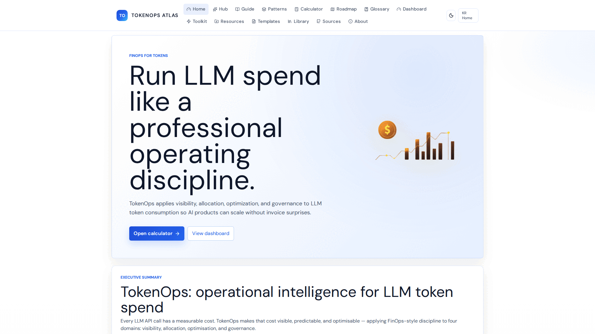
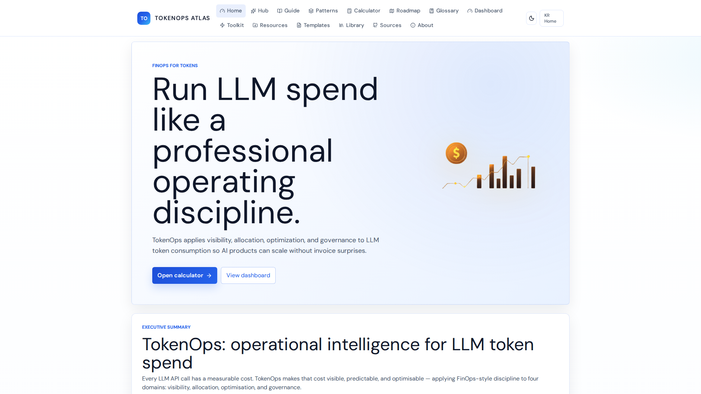
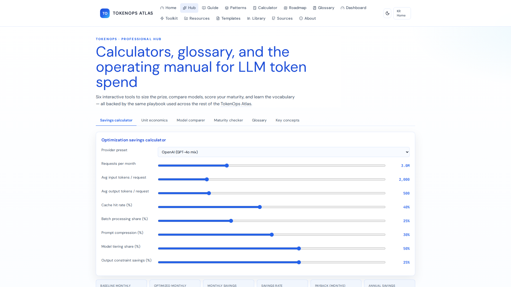
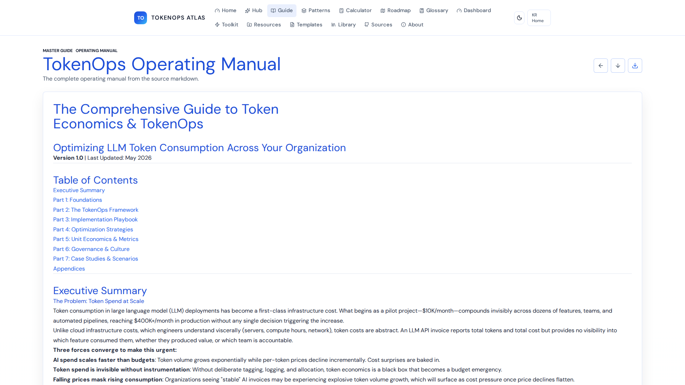
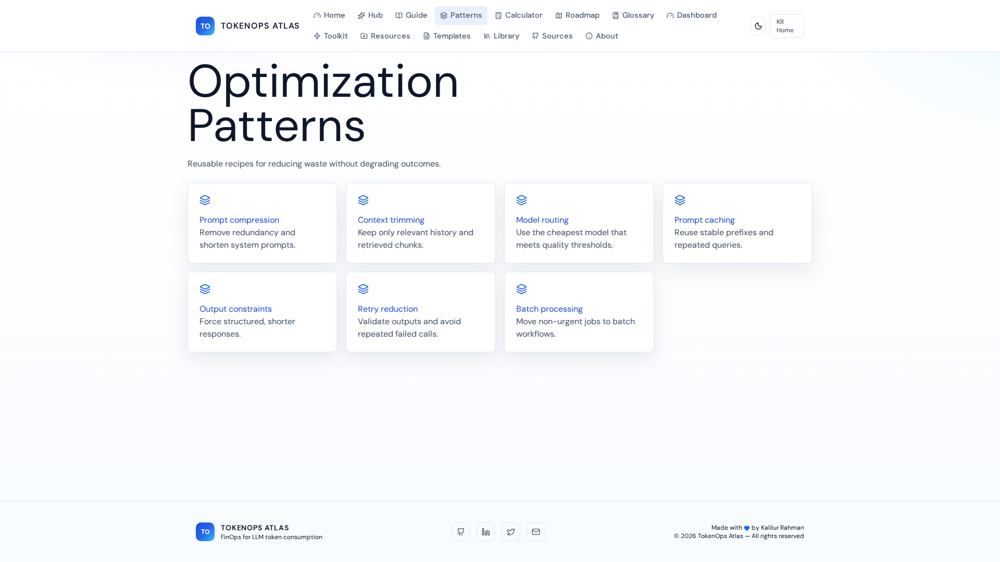
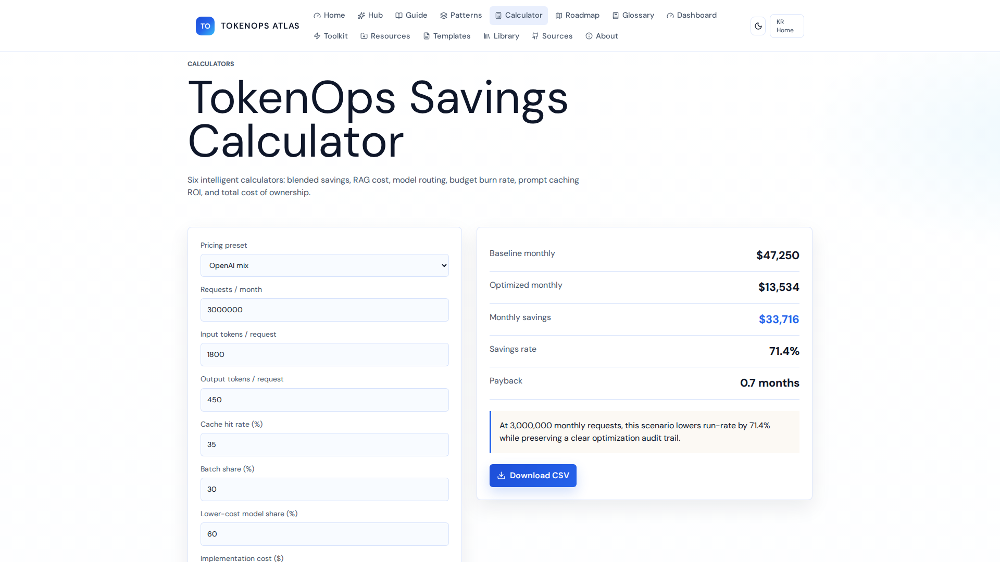
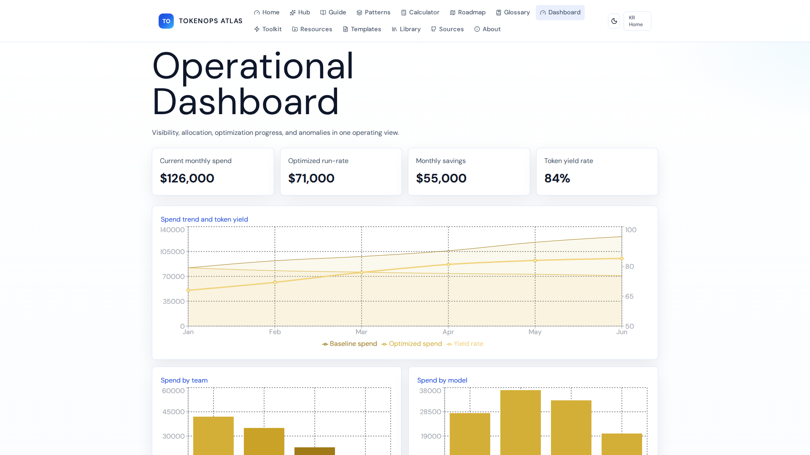
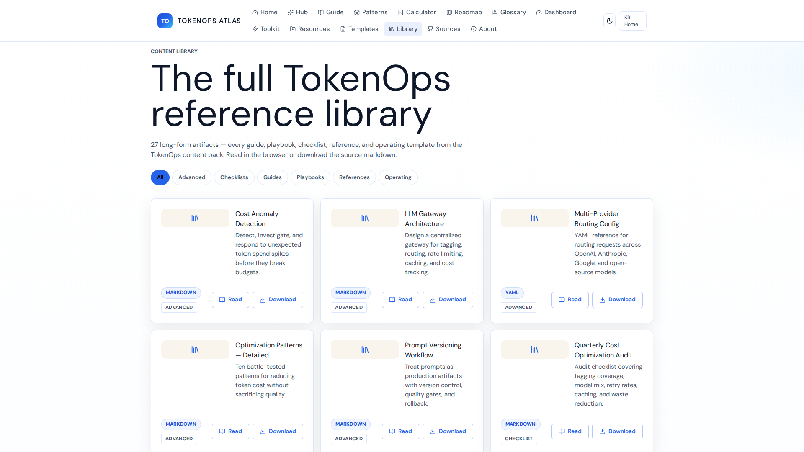

# TokenOps - FinOps for Tokens



## Overview

TokenOps applies visibility, allocation, optimization, and governance to LLM token consumption so AI products can scale without invoice surprises. It acts as operational intelligence for LLM token spend, applying FinOps-style discipline to four key domains.

## Features

- **Visibility:** Know which services, features, teams, and use cases consume tokens and at what cost. Target: Tagging coverage %.
- **Optimization:** Reduce waste through prompt engineering, model tiering, caching, and context management. Target: Cost per 1K calls.
- **Allocation:** Join usage metadata with billing data so token costs become accountable.
- **Governance:** Embed token economics into budgets, alerts, reviews, and architecture decisions. Target: Budget utilization %.

## Application Sections

### Optimize (Token Optimization Playbook)

The Optimize hub (`/optimize`) is the exhaustive, tool-by-tool guide to spending the
fewest tokens and credits for the best result. It contains:

- **Techniques Catalog** (`/techniques`) — every high-leverage lever: prompt caching,
  Caveman/semantic compression, model routing, context editing, compaction, RAG,
  prompt compression, semantic caching, batching, output control, instruction files,
  agent budgets, distillation, and FinOps metering — each with typical savings,
  effort, and impact.
- **Tool-Specific Guides** (`/tool-guides`) — credit/token playbooks for Claude &
  Claude Code, Lovable, ChatGPT/OpenAI, Google Gemini, Cursor, GitHub Copilot, and
  media/productivity tools, plus a caching & batch comparison table.
- **Caveman Compression** (`/caveman`) — the telegram-style prompt method: keep/drop
  rules, before→after, realistic savings (14–45%), and a drop-in skill snippet.
- **Prompt Templates & Checklists** (`/prompt-templates`) — copy-paste scaffolds for
  caching, routing, output control, compaction, and project memory, plus pre-flight,
  per-prompt, production, and FinOps checklists.

> Pricing, discounts, and TTLs change frequently — figures are reviewed June 2026.
> Always confirm current numbers in each provider's own docs before budgeting.

### Home

The landing page providing an executive summary of TokenOps and the core value proposition.


### Hub

Central hub for operational intelligence and managing token spend.


### Guide

Detailed guide to understanding and instrumenting token economics.


### Patterns

Typical savings profiles and techniques like model routing, prompt caching, and compression.


### Calculator

Interactive calculator to project and estimate token costs based on volume and techniques used.


### Dashboard

View key metrics, utilization, and cost breakdown in a unified dashboard.


### Library

Content library containing long-form artifacts, playbooks, checklists, and reference materials.


## Getting Started

To run the application locally:

1. Clone the repository.
2. Install the dependencies:
   ```bash
   npm install
   ```
3. Run the development server:
   ```bash
   npm run dev
   ```
4. Access the application in your browser.

## Built With

- [React](https://reactjs.org/)
- [TanStack Start / Router](https://tanstack.com/router)
- [Tailwind CSS](https://tailwindcss.com/)
- [Radix UI](https://www.radix-ui.com/)
- [Vite](https://vitejs.dev/)

---

Made with ❤️ by Kalilur Rahman
